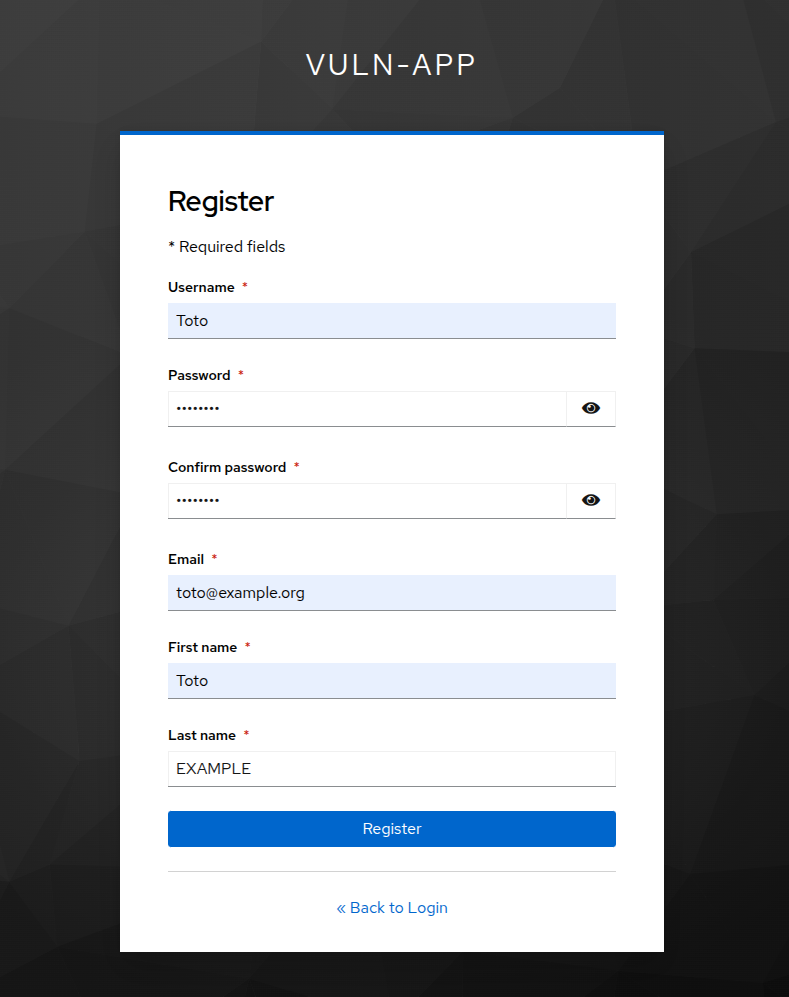
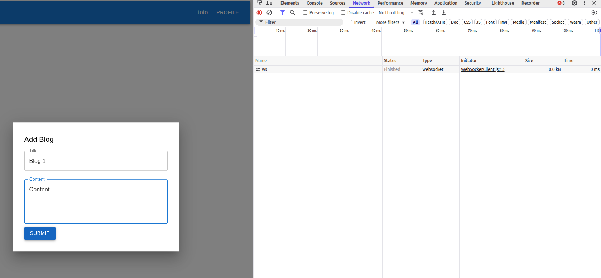
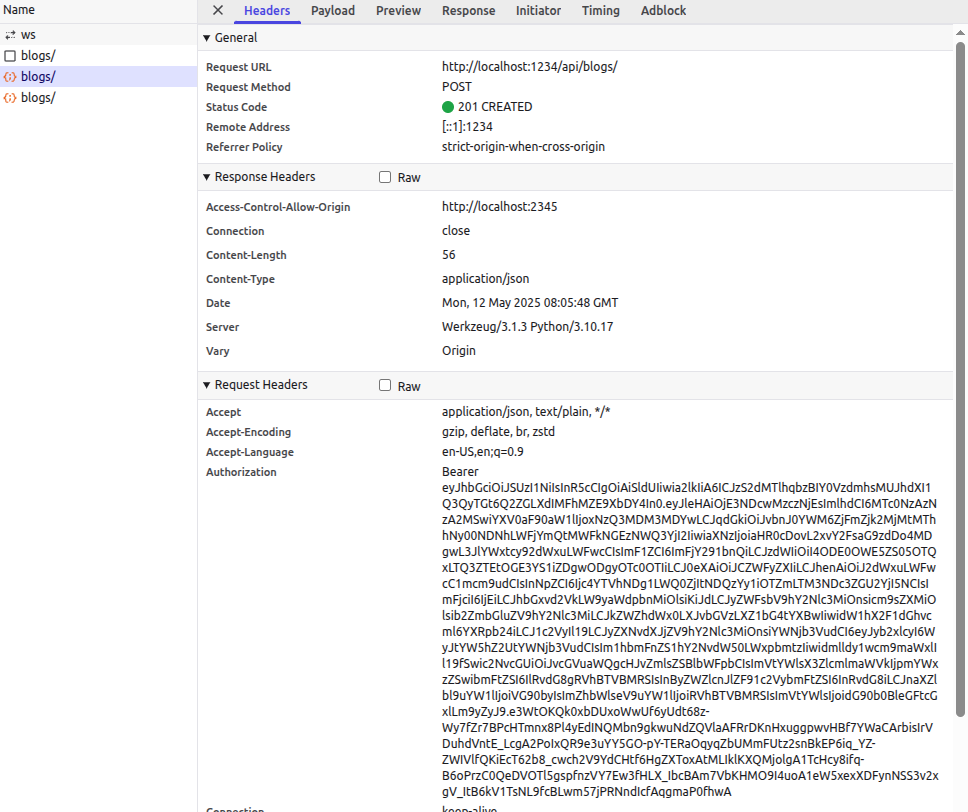
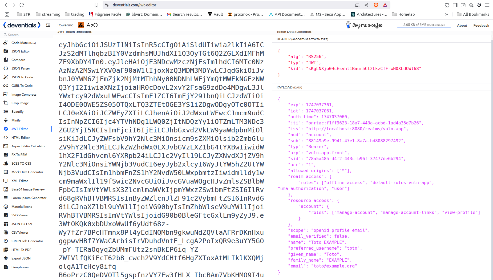
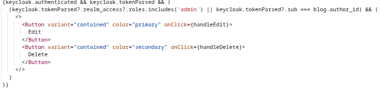
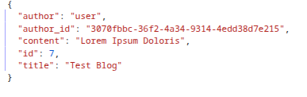
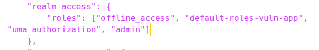
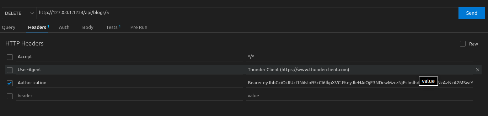

# 1. Architecture

| Composant | Technologie | Exposition | Description |
|-----------|-------------|------------|-------------|
| Frontend | React.js | 0.0.0.0:2345 | Permet d'interagir avec l'API |
| API | Flask | 0.0.0.0:1234 | Permet d'interagir avec la DB de manière "procédurale" |
| IDP | Keycloak | 0.0.0.0:8080 | Permet d'enregister et d'authentifier les utiisateurs de l'application |
| DB | PostgreSQL | NA | Enregistre les utilsateurs et données de l'App |

# 2. Objectif
Compromettre l'intégrité des données, e.g supprimer/modifier les blogs des autres utilisateurs.

# 3. Déroulement
## 3.1. S'enregistrer
## 3.2. Compromission

# 4. Solution
## 4.1. Enregistrement
4.1.1.

4.1.2.

## 4.2. Compromission
4.2.1. Création d'un blog

4.2.2. Récupération du JWT

4.2.3. Modification du JWT

2 Solutions :
- modifier le sub

- modifications des rôles pour avoir le rôle 'admin'

4.2.4. Utiliser votre client HTTP favori pour modifier les headers et mettre le nouveau JWT
